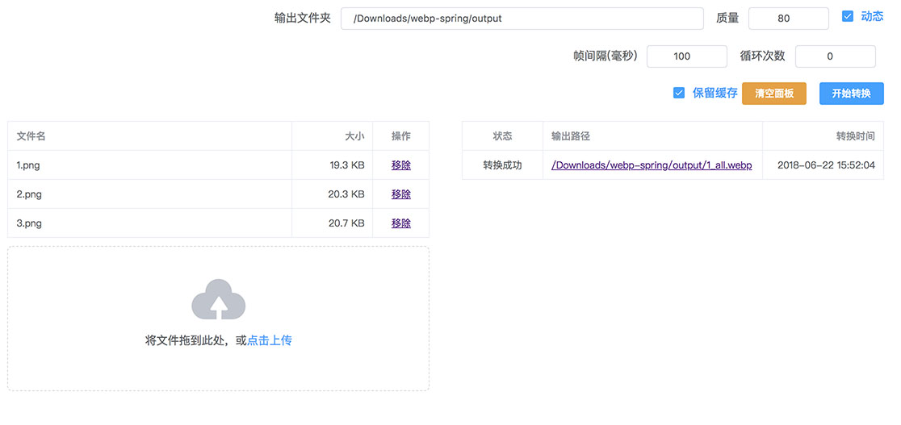

# webp-spring
webp转换器

### 直接使用
到[releases](https://github.com/dengyuhan/webp-spring/releases)下载最新版zip

解压后终端执行`webp-start.sh`  
*执行前需要赋予webp-start.sh读写权限

执行后在浏览器打开`http://localhost:8080`  

*需要java环境

